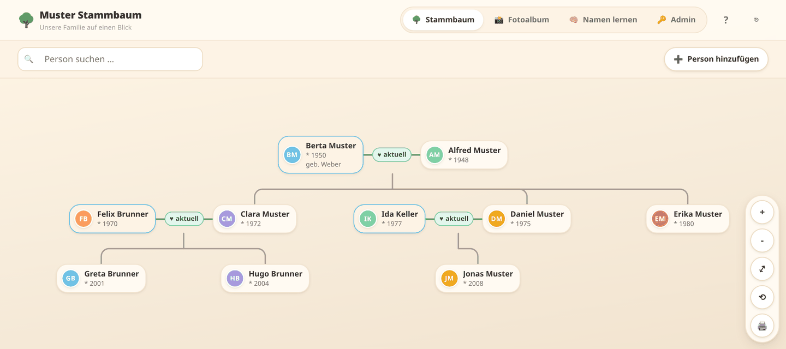
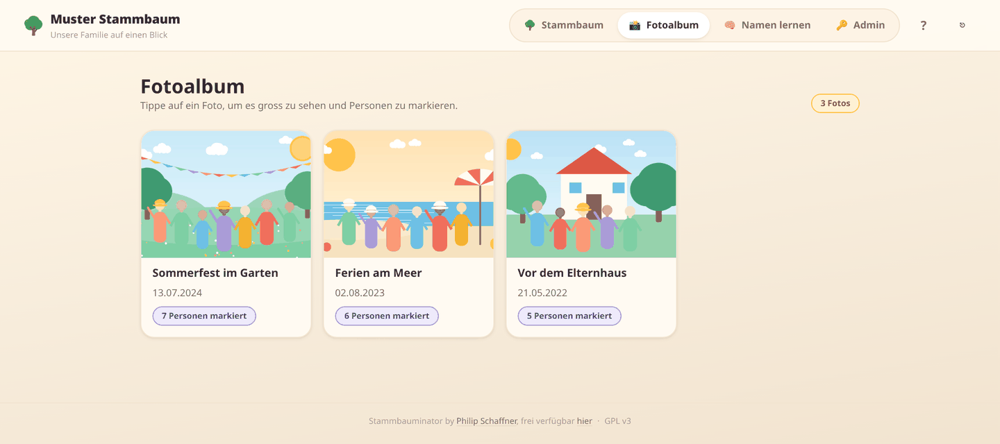
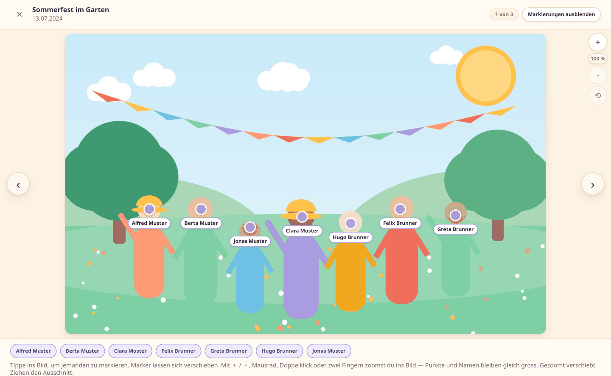
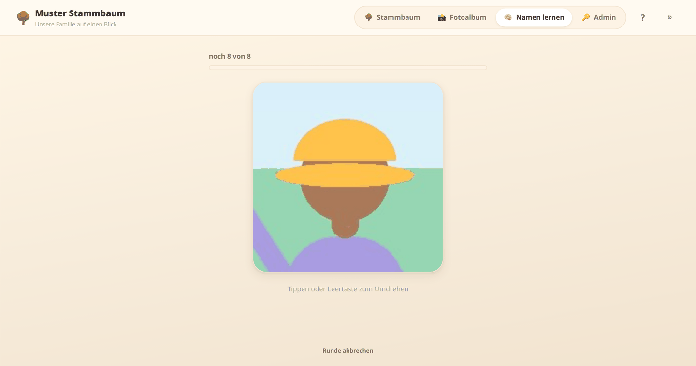

# Stammbauminator 🌳

Passwortgeschützte Webapp für den Stammbaum einer Familie — nicht auf eine
bestimmte Familie zugeschnitten. Welcher Name in der Kopfzeile steht, wird im
Adminbereich eingestellt: Aus dem Familiennamen „Muster" wird „Muster Stammbaum".



## Was die App kann

**Stammbaum** — Paare als Knoten, Kinder darunter, Personendetails im
Seitenpanel. Bis zu zwei Partnerschaften pro Blutlinien-Person (links / rechts).
Zoomen, verschieben, suchen — und auf ein Blatt Papier drucken.

**Fotoalbum** — Gruppenfotos hochladen und Personen direkt im Bild markieren.
Ein Tipp auf eine Markierung öffnet die Person, ein Tipp auf einen Namen
darunter hebt sie im Bild hervor.





**Portraits ohne Extraarbeit** — pro Person lässt sich ein Portrait hochladen.
Fehlt eines, schneidet die App es selbst aus dem aktuellsten Gruppenfoto, auf
dem die Person markiert ist. Wie gross der Ausschnitt sein muss, schätzt sie aus
dem Abstand zur nächsten Markierung — dasselbe Signal, das eine
Gesichtserkennung liefern würde, nur ohne Modell. Gibt es kein Foto, bleiben die
Initialen.

**Namen lernen** — Lernkärtchen mit dem Gesicht auf der Vorder- und dem Namen
auf der Rückseite. Elternpaar und Generationentiefe sind wählbar; wer nicht
sass, kommt später nochmals, bis er sitzt. Praktisch für alle, die frisch in
eine grosse Familie hineingeheiratet sind.



**Admin** — App-Name setzen, Fotos verwalten, Personen löschen (mit Vorschau der
Auswirkungen), Passwörter ändern.

> Die Screenshots zeigen eine erfundene Beispielfamilie. Die Figuren auf den
> Fotos sind die mitgelieferten Platzhalterbilder aus `public/img/` — es sind
> keine echten Personen abgebildet.

## Zugang

Zugang über zwei Passwörter statt Benutzerkonten: ein Familien-Passwort für den
Zugang und ein Admin-Passwort für den Adminbereich. Beide müssen mindestens
12 Zeichen lang sein. Der Adminmodus ist befristet: 30 Minuten nach dem
Freischalten fällt die Sitzung von selbst wieder auf den Familienzugang zurück —
angemeldet bleibt man, nur die Adminrechte sind weg. Der Familienname steht auch
auf der Anmeldeseite, damit die Familie sieht, dass sie am richtigen Ort ist —
er ist damit für jeden lesbar, der die Adresse kennt. Ist kein Name gesetzt,
steht dort „Stammbauminator".

## Stack

Node 24 (Express 5) + `node:sqlite` (eingebaut, keine nativen Abhängigkeiten),
Vanilla-JS-Frontend ohne Build-Schritt. Läuft in Docker hinter einem Reverse
Proxy.

## Lokal starten

```bash
npm install
```

```bash
npm start
```

Die App läuft danach auf <http://localhost:3000>. Beim allerersten Start legt sie
`data/stammbaum.db` an und setzt die Passwörter aus den Umgebungsvariablen
`INITIAL_FAMILY_PASSWORD` / `INITIAL_ADMIN_PASSWORD` (siehe `.env.example`).
**Ein fest eingebautes Standardpasswort gibt es nicht.** Fehlt eine der beiden
Variablen, erzeugt die App stattdessen ein zufälliges starkes Passwort und gibt
es einmalig auf der Konsole aus — also nach dem ersten Start ins Log schauen.
Danach stehen die Passwörter gehasht in der Datenbank und werden nur noch über
den Admin-Bereich geändert (mindestens 12 Zeichen).

Für die lokale Entwicklung ohne HTTPS muss das Secure-Flag am Cookie aus sein:

```bash
SECURE_COOKIES=false npm run dev
```

Ohne `SECURE_COOKIES=false` heisst das Session-Cookie `__Host-stb_session` und
verlangt damit zwingend HTTPS — über `http://localhost` verwirft der Browser es,
die Anmeldung schlägt also fehl. Zusätzlich sendet die App dann
`Strict-Transport-Security`, was den Browser für diesen Host dauerhaft auf HTTPS
festnagelt. Beides ist im Produktivbetrieb hinter dem Proxy erwünscht, lokal
nicht.

## Struktur

```
.
├── server/              Backend (Express, node:sqlite)
│   ├── index.js         Einstiegspunkt, Port 3000
│   ├── db.js            Schema, Migrationen, Seed
│   ├── auth.js          Sessions, scrypt-Hashing, Rate-Limit
│   └── routes/          API-Routen unter /api/*
├── public/              Frontend, wird statisch ausgeliefert
│   ├── index.html       App-Shell
│   ├── css/             tokens.css (Design-System) + Modul-CSS
│   ├── js/              api.js, store.js, image.js, app.js, tree.js,
│   │                    person.js, photos.js, admin.js, boot.js
│   └── img/
├── data/                Persistent, nicht im Git
│   ├── stammbaum.db     SQLite-Datenbank (WAL-Modus)
│   └── uploads/         Hochgeladene Fotos
├── docs/screenshots/    Bilder für dieses README
├── Dockerfile
├── docker-compose.yml
├── .env.example
├── app.json             Metadaten für ein App-Dashboard (optional)
├── SPEC.md
└── DEPLOY.md
```

## Weiterführend

- **[SPEC.md](SPEC.md)** — verbindliche technische Spezifikation: Datenmodell,
  HTTP-API, Auth, Frontend-Verträge, Design-System.
- **[DEPLOY.md](DEPLOY.md)** — Deployment auf einen Server, Backup, Updates,
  Fehlersuche.

## Lizenz

[GNU General Public License v3.0 oder später](LICENSE) — © Philip Schaffner.

Die App darf frei genutzt, verändert und weitergegeben werden. Wer sie
weitergibt oder eine veränderte Fassung veröffentlicht, muss den Quellcode
ebenfalls unter der GPL zugänglich machen.

Zum Datumsformat: Gespeichert wird immer ISO (`2000-01-01`), angezeigt und
eingegeben wird `TT.MM.JJJJ`. Teilangaben wie `01.2000` oder `2000` sind
überall erlaubt — bei alten Jahrgängen ist der genaue Tag oft unbekannt.
